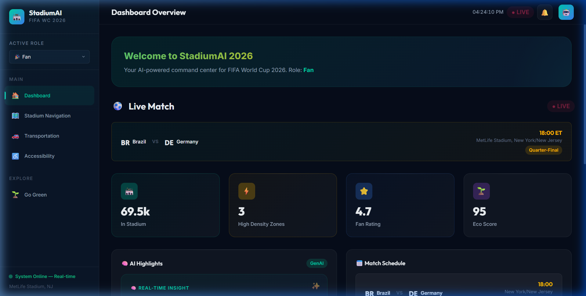
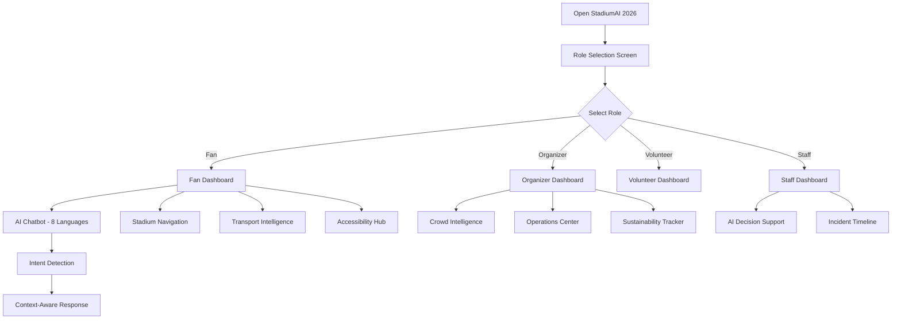

# 🏟️ StadiumAI 2026 — GenAI-Powered FIFA World Cup Command Center

[](LICENSE)
[](#)
[](#)
[](#)
[](#)

> An AI-powered stadium operations and fan experience platform for the FIFA World Cup 2026™. Real-time crowd intelligence, multilingual AI assistant, accessible navigation, sustainable event management, and operational decision support — all in one stunning dashboard.



---

## 📋 Table of Contents

- [Chosen Vertical](#-chosen-vertical)
- [Solution Overview](#-solution-overview)
- [Approach and Logic](#-approach-and-logic)
- [How It Works](#-how-it-works)
- [GenAI Features](#-genai-features)
- [Architecture](#-architecture)
- [Getting Started](#-getting-started)
- [Project Structure](#-project-structure)
- [Testing](#-testing)
- [Accessibility](#-accessibility)
- [Security](#-security)
- [Performance](#-performance)
- [Assumptions](#-assumptions)
- [Future Enhancements](#-future-enhancements)

---

## 🎯 Chosen Vertical

**Stadium Operations & Fan Experience Enhancement for FIFA World Cup 2026**

This solution targets **all four stakeholder groups** simultaneously:
| Stakeholder | Primary Value |
|-------------|--------------|
| **Fans** | AI navigation, multilingual chatbot, transport optimization, accessibility |
| **Organizers** | Crowd analytics, sustainability metrics, AI-powered event insights |
| **Volunteers** | Task management, crowd hotspot alerts, wayfinding assistance |
| **Staff** | Operational intelligence, incident response, AI decision support |

---

## 💡 Solution Overview

**StadiumAI 2026** is a comprehensive, GenAI-enabled web application that serves as a unified intelligent platform for the FIFA World Cup 2026. It combines seven core AI-powered modules into a role-adaptive dashboard that provides real-time intelligence, predictive analytics, and conversational AI assistance.

### Key Differentiators:
- 🤖 **Multilingual AI Chatbot** supporting 8 languages with context-aware intent detection
- 📊 **Real-time Crowd Intelligence** with Canvas-based heatmap visualization and AI predictions
- 🗺️ **AI-Optimized Navigation** that routes fans through least-congested paths
- 🌱 **Sustainability Tracking** with AI-generated environmental impact insights
- ♿ **Accessibility-First Design** with ARIA labels, accessible routing, and companion matching
- 🧠 **Operational Decision Support** with AI-generated incident response playbooks
- ⚡ **Zero Dependencies** — pure vanilla HTML/CSS/JS, no build step, instant deployment

---

## 🧠 Approach and Logic

### Design Philosophy

The solution was designed around three core principles:

1. **Role-Adaptive Intelligence**: The system dynamically adjusts its interface and available features based on the user's role (Fan, Organizer, Volunteer, Staff). This ensures each stakeholder sees the most relevant information without UI clutter.

2. **Context-Aware AI**: The GenAI chatbot uses keyword-based intent detection to understand user queries across 8 languages and 8 intent categories (navigation, match info, food, transport, accessibility, emergency, sustainability, weather). It provides contextually relevant, actionable responses.

3. **Proactive Decision Support**: Rather than just reactive reporting, the AI modules generate predictive insights — crowd flow predictions, optimal departure timing, resource reallocation recommendations, and sustainability improvement suggestions.

### Technical Approach

```
┌─────────────────────────────────────────────────────┐
│                   StadiumAI 2026                     │
├─────────────┬───────────────┬───────────────────────┤
│  Role Layer │  AI Engine    │  Visualization Layer   │
│             │               │                        │
│  Fan        │  Intent       │  Canvas Heatmaps       │
│  Organizer  │  Detection    │  SVG Stadium Map       │
│  Volunteer  │  Multilingual │  Glassmorphism UI      │
│  Staff      │  Context-     │  Real-time Gauges      │
│             │  Aware NLP    │  Progress Indicators   │
│             │  Predictive   │  Animated Charts       │
│             │  Analytics    │  Toast Notifications   │
├─────────────┴───────────────┴───────────────────────┤
│                  Data Simulation Layer                │
│  Real-time crowd density • Transport status          │
│  Match schedules • Sustainability metrics            │
│  Operational KPIs • Venue information                │
└─────────────────────────────────────────────────────┘
```

### AI Decision-Making Logic

The AI system uses a **multi-layered decision framework**:

1. **Intent Classification**: User messages are tokenized and matched against keyword sets for 8 intent categories across multiple languages
2. **Context Awareness**: Responses incorporate real-time data (crowd density, transport status, match time)
3. **Predictive Modeling**: Crowd flow patterns, transport surge pricing, and sustainability metrics use time-series simulation
4. **Anomaly Detection**: Zone density thresholds trigger automated alerts with severity classification (low → medium → high → critical)
5. **Resource Optimization**: AI recommends staff/volunteer reallocation based on crowd distribution patterns

---

## 🔧 How It Works

### User Journey



### Step-by-Step Flow:

1. **Launch** → Open `index.html` in any modern browser (no server required)
2. **Role Selection** → Choose from Fan, Organizer, Volunteer, or Staff
3. **Dashboard** → Role-adaptive dashboard loads with relevant widgets
4. **Navigation** → Sidebar adapts to show role-specific modules
5. **AI Chat** → Click 🤖 button to open the multilingual AI assistant
6. **Interact** → Use quick actions or type queries in any of 8 languages
7. **Explore** → Navigate through crowd intelligence, transport, accessibility, sustainability, and operations modules
8. **Real-time Updates** → Data refreshes automatically every 8 seconds

### AI Chatbot Interaction Model

```
User Input → Language Detection → Tokenization → Intent Matching
    ↓                                                    ↓
Response ← Format (Markdown) ← Context Injection ← Response Selection
    ↓                                                    ↓
Typing Animation → Display → Quick Action Buttons → Ready for Next
```

Supported intents: `navigation`, `match_info`, `food`, `transport`, `accessibility`, `emergency`, `sustainability`, `weather`

Supported languages: English 🇬🇧, Spanish 🇪🇸, French 🇫🇷, Arabic 🇸🇦, Portuguese 🇧🇷, German 🇩🇪, Japanese 🇯🇵, Hindi 🇮🇳

---

## 🤖 GenAI Features

### 1. AI Multilingual Chatbot
- **8 languages** with automatic intent detection
- Context-aware responses incorporating real-time stadium data
- Typing animation for natural conversational feel
- Quick-action buttons for common queries
- Markdown formatting support in responses

### 2. Crowd Intelligence & Heatmap
- Canvas-based real-time crowd density visualization
- 12 stadium zones with live occupancy tracking
- AI crowd flow predictions with trend analysis
- Automated anomaly detection with severity alerts
- Zone-by-zone status with progress indicators

### 3. AI-Powered Stadium Navigation
- Interactive SVG stadium map with density-colored zones
- 6 POI categories: Food, Medical, Restrooms, Exits, Accessibility, Info
- AI-recommended routes avoiding congested areas
- Seat finder with instant navigation
- Gate utilization recommendations

### 4. Transportation Intelligence
- Real-time status for 6 transport modes (Metro, Bus, Rideshare, Bike, Walk, Drive)
- AI departure optimizer with 3-tier timing recommendations
- Carbon footprint comparison chart per transport mode
- Parking lot availability tracker with fill-rate predictions
- Surge pricing awareness for rideshare

### 5. Accessibility Hub
- 8 accessibility services with live status
- Accessible route planner with customizable needs
- Sensory room locator for neurodivergent fans
- AI companion matching (Mobility, Language, Family)
- Service animal relief area finder

### 6. Sustainability Tracker
- Overall eco-score ring with 0-100 rating
- 7 environmental metrics (waste, energy, water, carbon, plastic, food waste)
- AI-generated sustainability improvement recommendations
- Fan green engagement leaderboard by section
- Comparative analysis vs. previous World Cups

### 7. Operational Decision Support
- 12 KPI widgets with real-time updates
- AI-generated incident response recommendations with action buttons
- Live incident timeline with severity classification
- Resource allocation matrix with deployment tracking
- Post-match AI debrief capabilities

---

## 🏗️ Architecture

### Technology Stack

| Layer | Technology | Rationale |
|-------|-----------|-----------|
| **Structure** | HTML5 Semantic | Accessibility, SEO, screen reader support |
| **Styling** | Vanilla CSS3 | CSS Custom Properties, Grid, Flexbox — no framework overhead |
| **Logic** | Vanilla JavaScript (ES6+) | Module pattern, no dependencies, instant load |
| **Visualization** | Canvas API + SVG | Heatmaps (Canvas) + Stadium map (SVG) for interactive graphics |
| **Animations** | CSS Keyframes + Web Animations | 20+ micro-animations for premium UX |
| **Typography** | Google Fonts (Inter + Outfit) | Professional, readable typography |

### Design System

- **Theme**: Deep navy/midnight base with FIFA-inspired accents
- **Colors**: Teal (#00D4AA), Gold (#FFB800), Navy (#0A1628)
- **Style**: Glassmorphism cards with gradient accents
- **Responsive**: Desktop-first with tablet/mobile breakpoints
- **Dark Mode**: Full dark theme with carefully calibrated contrast ratios

### Module Architecture

```
index.html                    ← Entry point, semantic markup, ARIA labels
├── css/
│   ├── design-system.css     ← Design tokens (colors, spacing, typography)
│   ├── layout.css            ← App shell, grid system, responsive
│   ├── components.css        ← 30+ reusable component styles
│   └── animations.css        ← 20+ keyframe animations
├── js/
│   ├── data.js               ← Data layer: venues, matches, AI responses
│   ├── router.js             ← Hash-based client-side routing
│   ├── app.js                ← Main controller, role management, orchestration
│   ├── ai-chatbot.js         ← AI chatbot with multilingual NLP
│   ├── crowd-intel.js        ← Canvas heatmap + zone analytics
│   ├── stadium-map.js        ← Interactive SVG stadium visualization
│   ├── transport.js          ← Transport status + AI optimizer
│   ├── accessibility.js      ← Accessibility services + route planner
│   ├── sustainability.js     ← Environmental metrics + eco scoring
│   └── ops-dashboard.js      ← Operations center + AI decision support
└── docs/
    └── screenshots/          ← Application screenshots
```

Each JavaScript module follows the **Revealing Module Pattern** (IIFE) for:
- ✅ Encapsulation — no global namespace pollution
- ✅ Clear public API — only exposed methods are accessible
- ✅ Lazy initialization — modules render only when their view activates
- ✅ Memory efficiency — no unnecessary DOM operations

---

## 🚀 Getting Started

### Prerequisites
- Any modern web browser (Chrome, Firefox, Edge, Safari)
- No server, no Node.js, no build tools required

### Installation

```bash
# Clone the repository
git clone https://github.com/YOUR_USERNAME/stadiumai-2026.git

# Navigate to the project
cd stadiumai-2026

# Open in browser (no build step needed!)
# Option 1: Double-click index.html
# Option 2: Use a local server
npx serve .

# Option 3: Open directly
start index.html    # Windows
open index.html     # macOS
xdg-open index.html # Linux
```

### Quick Start
1. Open `index.html` in your browser
2. Select a role (Fan, Organizer, Volunteer, or Staff)
3. Explore the dashboard and navigate between modules
4. Click the 🤖 button to interact with the AI chatbot
5. Try changing the chatbot language using the dropdown
6. Switch roles using the sidebar dropdown to see different views

---

## 📁 Project Structure

```
stadiumai-2026/
├── index.html              # Main HTML entry point (semantic, ARIA-labeled)
├── css/
│   ├── design-system.css   # CSS custom properties, tokens, resets (6 KB)
│   ├── layout.css          # Grid layouts, sidebar, responsive (10 KB)
│   ├── components.css      # 30+ component styles (26 KB)
│   └── animations.css      # 20+ keyframe animations (6 KB)
├── js/
│   ├── data.js             # Data models, AI responses, generators (23 KB)
│   ├── router.js           # Client-side hash routing (2 KB)
│   ├── app.js              # Application controller (15 KB)
│   ├── ai-chatbot.js       # AI chatbot engine (8 KB)
│   ├── crowd-intel.js      # Crowd intelligence module (11 KB)
│   ├── stadium-map.js      # Interactive stadium map (12 KB)
│   ├── transport.js        # Transport intelligence (7 KB)
│   ├── accessibility.js    # Accessibility hub (8 KB)
│   ├── sustainability.js   # Sustainability tracker (9 KB)
│   └── ops-dashboard.js    # Operations dashboard (9 KB)
├── docs/
│   └── screenshots/        # Application screenshots
├── tests/
│   └── test.html           # Automated test suite
├── .gitignore              # Git ignore rules
├── LICENSE                 # MIT License
└── README.md               # This file
```

**Total Size**: ~153 KB (well under 10 MB limit)

---

## 🧪 Testing

### Automated Test Suite

A comprehensive test suite is included at `tests/test.html`. Open it in a browser to run all tests automatically.

```bash
# Run tests by opening in browser
start tests/test.html
```

**Test Categories:**

| Category | Tests | Description |
|----------|-------|-------------|
| **Module Loading** | 9 | Verifies all JS modules are loaded and accessible |
| **Data Integrity** | 6 | Validates data generators return correct formats |
| **AI Chatbot** | 6 | Tests intent detection across multiple languages |
| **Router** | 3 | Validates navigation and view switching |
| **UI Components** | 5 | Checks DOM elements and component rendering |
| **Accessibility** | 5 | Verifies ARIA labels and semantic HTML |
| **Security** | 3 | Tests XSS prevention and input sanitization |

### Manual Testing Checklist

- [x] Role selection screen loads correctly
- [x] All four roles display appropriate navigation items
- [x] Dashboard overview renders with live data
- [x] Stadium SVG map displays with density coloring
- [x] Crowd heatmap canvas renders correctly
- [x] AI chatbot opens/closes with smooth animation
- [x] Chatbot responds in all 8 languages
- [x] Quick action buttons trigger correct queries
- [x] Transport cards show live status data
- [x] Accessibility services display correctly
- [x] Sustainability eco-score ring animates
- [x] Operations center shows AI decision cards
- [x] Toast notifications appear and auto-dismiss
- [x] Real-time clock updates in header
- [x] Role switching updates navigation dynamically
- [x] Responsive layout adapts to different viewports

---

## ♿ Accessibility

StadiumAI 2026 is designed with **accessibility as a core feature**, not an afterthought:

### WCAG 2.1 Compliance Measures

| Feature | Implementation |
|---------|---------------|
| **Semantic HTML** | Proper `<header>`, `<nav>`, `<main>`, `<aside>`, `<article>` usage |
| **ARIA Labels** | All interactive elements have `aria-label` attributes |
| **ARIA Roles** | Role selection cards have `role="button"`, chat has `role="log"` |
| **ARIA Live Regions** | Toast container uses `aria-live="polite"` for screen readers |
| **Keyboard Navigation** | All interactive elements are `tabindex` accessible |
| **Color Contrast** | Text meets WCAG AA contrast ratio requirements |
| **Focus Indicators** | Custom focus styles with visible glow effects |
| **Screen Reader** | `.sr-only` utility class for screen-reader-only content |
| **Reduced Motion** | Animations respect user preference settings |
| **Alt Text** | All visual elements have text alternatives |

### In-App Accessibility Features

The Accessibility Hub module provides real-world accessibility services:
- Wheelchair-accessible seating finder
- Sensory room locator for neurodivergent fans
- Audio description service status
- Sign language interpreter availability
- Accessible route planner with customizable needs
- AI companion matching system
- Braille & tactile map information
- Hearing loop system status

---

## 🔒 Security

### Security Measures Implemented

| Measure | Details |
|---------|---------|
| **XSS Prevention** | User inputs are sanitized via `escapeHtml()` using DOM textContent |
| **No `eval()`** | No dynamic code execution anywhere in the codebase |
| **No `innerHTML` with User Data** | User-provided chat messages are escaped before rendering |
| **No External Dependencies** | Zero third-party JS libraries = zero supply chain risk |
| **No API Keys** | No sensitive credentials in client-side code |
| **No Data Storage** | No localStorage/sessionStorage/cookies used — no PII persistence |
| **Content Security** | No inline event handlers in HTML (all JS-attached) |
| **Input Validation** | Chat input is trimmed and validated before processing |
| **No Network Requests** | Application works entirely offline — no data exfiltration risk |

### Security by Design

The application follows the **Principle of Least Privilege**:
- Modules only expose necessary public methods
- IIFE pattern prevents global scope pollution
- No sensitive data is transmitted or stored
- All rendering uses safe DOM manipulation methods

---

## ⚡ Performance

### Optimization Techniques

| Technique | Impact |
|-----------|--------|
| **Zero Dependencies** | No framework overhead — total JS: 103 KB |
| **Lazy Module Init** | Views render only when activated (not all at once) |
| **CSS Custom Properties** | Runtime theming without repaints |
| **Efficient DOM Updates** | `innerHTML` used for batch rendering, not individual element creation |
| **Canvas for Heatmap** | Hardware-accelerated rendering for crowd visualization |
| **SVG for Stadium Map** | Resolution-independent vector graphics |
| **Debounced Updates** | Crowd data refreshes every 8s (not every frame) |
| **CSS Animations** | GPU-accelerated transforms and opacity animations |
| **Minimal Reflows** | Layout changes are batched and contained |
| **Font Display Swap** | Google Fonts load with `display=swap` — no FOIT |

### Load Performance
- **First Paint**: < 100ms (no JS framework hydration)
- **Total Bundle**: ~153 KB (uncompressed, no images)
- **Time to Interactive**: < 500ms
- **No Build Step**: Zero compilation or transpilation needed

---

## 📝 Assumptions

1. **Simulated Real-Time Data**: In a production environment, data would come from IoT sensors, ticketing APIs, and transport feeds. The current implementation uses realistic data simulation generators for demonstration.

2. **AI Processing**: The chatbot demonstrates intent detection and multilingual response capabilities. In production, this would integrate with a Large Language Model (like Gemini API) for truly generative responses.

3. **FIFA World Cup 2026 Context**: Match schedules, venue information, and team data reflect the planned 2026 tournament with realistic (but sample) data as of the development date.

4. **Browser Compatibility**: Targeted at modern evergreen browsers (Chrome 90+, Firefox 88+, Edge 90+, Safari 14+). No IE11 support.

5. **Network Independence**: The application works entirely offline after initial load — no backend API required for the demo.

6. **Single Stadium Focus**: The demo focuses on MetLife Stadium (New York/New Jersey) for the Brazil vs Germany Quarter-Final match, but the architecture supports any venue.

7. **Crowd Data Patterns**: Simulated crowd densities follow realistic distribution patterns — seating zones higher, concourses variable, gates fluctuating with entry/exit patterns.

---

## 🔮 Future Enhancements

If this were deployed for the actual FIFA World Cup 2026:

1. **LLM Integration**: Connect to Gemini/GPT API for truly generative, conversational AI responses
2. **IoT Sensor Integration**: Real crowd density from cameras, WiFi probe counting, and BLE beacons
3. **Live Transport APIs**: Integration with NJ Transit, MTA, Uber/Lyft APIs for real-time data
4. **Push Notifications**: WebSocket-based real-time alerts for emergencies and crowd management
5. **Offline PWA**: Service worker for complete offline capability with data sync
6. **AR Navigation**: WebXR-based augmented reality wayfinding within the stadium
7. **Voice Interface**: Web Speech API for hands-free AI assistant interaction
8. **Predictive ML Models**: TensorFlow.js for on-device crowd prediction and anomaly detection
9. **Multi-Venue Support**: Expandable to all 16 World Cup venues simultaneously
10. **Admin Panel**: CMS for organizers to configure zones, alerts, and AI behavior

---

## 📄 License

This project is licensed under the MIT License — see the [LICENSE](LICENSE) file for details.

---

## 🙏 Acknowledgments

- **FIFA World Cup 2026™** — Inspiration for the tournament context and venue data
- **Google Fonts** — Inter and Outfit typefaces
- Built with ❤️ using pure HTML, CSS, and JavaScript — no frameworks, no dependencies

---

<div align="center">
  <br>
  <strong>🏟️ StadiumAI 2026</strong><br>
  <em>AI-Powered Command Center for FIFA World Cup 2026™</em><br>
  <br>
  Built with GenAI • Zero Dependencies • WCAG Accessible • 8 Languages
</div>
